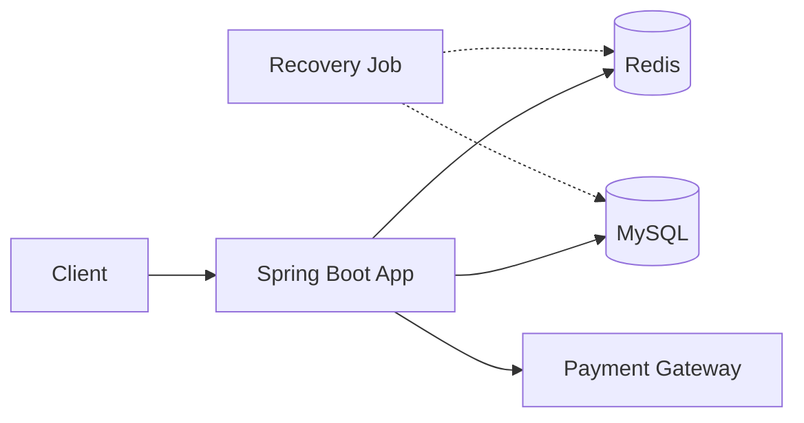
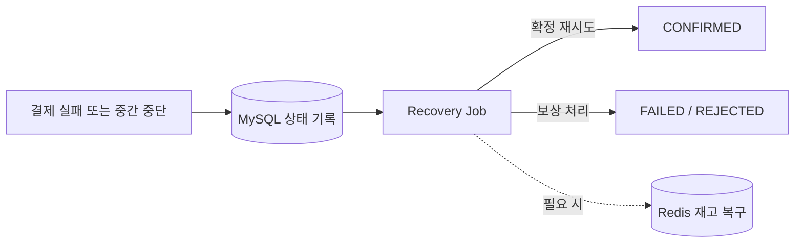
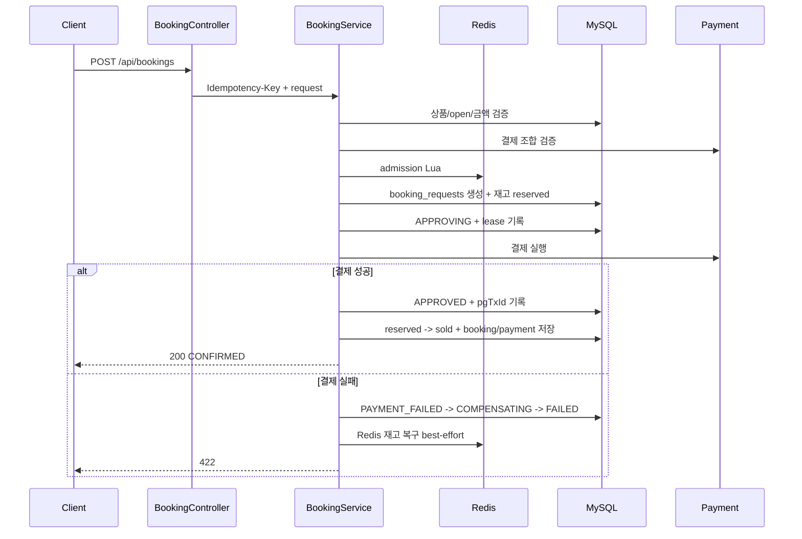
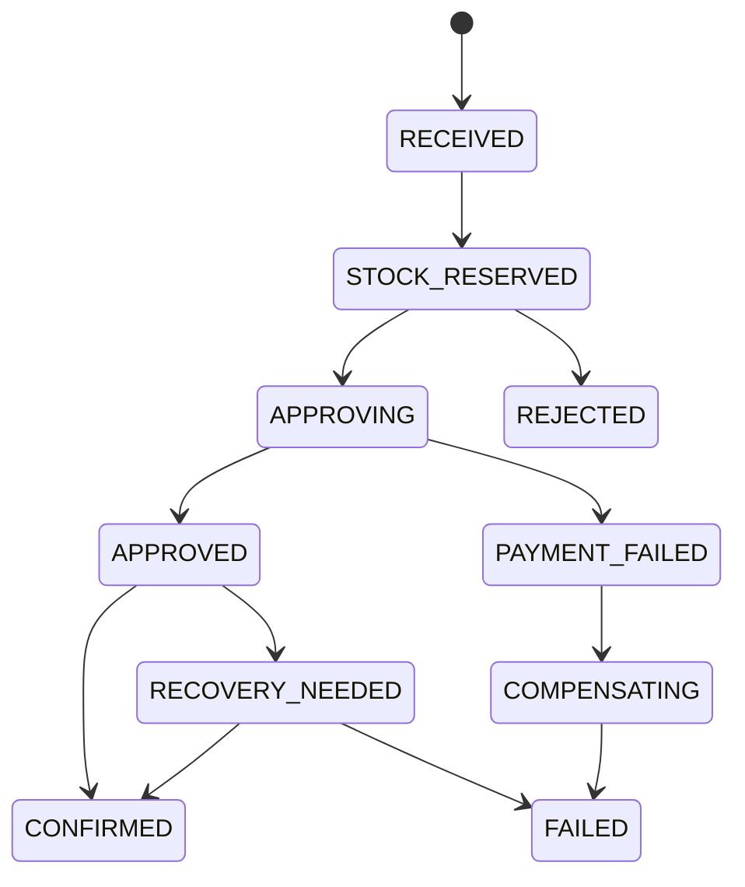

# Stay Booking

한정 수량 숙박 프로모션 예약 API입니다.

00시 오픈처럼 짧은 시간에 요청이 몰리는 상황에서 초과 판매를 막고, 멱등키로 중복 결제를 방지하며, 결제/예약 중간 실패를 복구 가능한 상태로 남기는 것을 목표로 합니다.

## 1. 목표와 설계 방향

목표는 한정 수량 프로모션 예약에서 발생하는 세 가지 위험을 제어하는 것입니다.

- **초과 판매**: 재고보다 많은 예약이 확정되면 안 됩니다.
- **중복 결제**: 같은 요청이 반복되어도 결제와 예약은 한 번만 처리되어야 합니다.
- **중간 실패**: 결제 승인, 예약 확정, 보상 중간에 멈춰도 다시 처리할 수 있어야 합니다.

이를 위해 다음 방향을 선택했습니다.

- **초과 판매 방지**: Redis admission으로 먼저 줄이고, MySQL 조건부 UPDATE로 최종 방어합니다.
- **중복 결제 방지**: `Idempotency-Key`, `request_hash`, DB unique constraint로 막습니다.
- **실패 복구**: 예약 요청 상태 머신과 Recovery Job으로 다시 처리할 수 있게 남깁니다.
- **장애 격리**: PG 지연과 장애가 예약 API 전체에 번지지 않도록 보호 장치를 둡니다.
- **검증 가능성**: MySQL 8, Redis 7 기반 통합 테스트와 로컬 부하테스트로 확인했습니다.

범위는 의도적으로 좁혔습니다. 인증/인가, 실제 PG 연동, 객실 타입별 재고, 운영자 화면은 제외하고, 동시성·멱등성·보상·복구에 집중했습니다.

<br>

## 2. 주요 흐름



예약 생성의 정상 경로는 다음 순서로 진행됩니다.

1. **Redis**: admission으로 예약 진입을 빠르게 허가하거나 거절합니다.
2. **MySQL**: 멱등성 기록과 DB 재고 예약을 남깁니다.
3. **Payment Gateway**: 카드/Y페이 결제를 승인하거나 거절합니다.
4. **MySQL**: 승인된 요청을 예약/결제 기록으로 확정합니다.

실패와 복구 흐름은 정상 경로에서 분리합니다.



Recovery Job은 `APPROVED`, `COMPENSATING`처럼 중간에 멈춘 요청을 다시 확인하고, 확정 재시도 또는 보상 처리 중 하나로 마무리합니다.

핵심 분리는 두 가지입니다.

- **트랜잭션 경계**: `BookingService`는 전체 흐름을 조율하지만, 메서드 전체를 하나의 DB 트랜잭션으로 묶지 않습니다. 외부 PG 호출 중 DB 커넥션을 붙잡으면 피크 상황에서 커넥션 풀이 고갈될 수 있기 때문입니다.
- **저장소 책임**: Redis는 매진 이후의 대량 요청을 빠르게 거절하는 admission gate이고, MySQL은 실제 예약 가능 수량과 멱등성의 최종 방어선입니다. Redis 값이 틀어져도 DB의 조건부 UPDATE가 초과 판매를 막습니다.

내부 코드는 modular monolith 안에서 헥사고날 경계를 둡니다.

| 패키지 | 역할 | 의존 방향 |
|--------|------|-----------|
| `api` | HTTP adapter. 요청/응답 DTO와 예외 응답 매핑 | `application` 호출 |
| `application` | 예약, 결제, 복구 유스케이스와 port | `domain`과 application port만 사용 |
| `domain` | 엔티티, 리포지토리, 상태 enum | 외부 레이어 비의존 |
| `infra` | Redis, PG simulator, Resilience4j, scheduler adapter | application port 구현 |

Controller는 HTTP DTO를 application command/result로 변환합니다. Redis admission과 PG 호출도 각각 `StockGatePort`, `ExternalPaymentGateway` port 뒤에 숨겨 application이 Lettuce, Lua, Resilience4j 구현을 직접 알지 않게 했습니다. 이 규칙은 ArchUnit 테스트로 고정합니다.

<br>

## 3. 예약 생성 흐름



흐름을 단계로 풀면 다음과 같습니다.

| 단계 | 처리 | 실패 시 |
|------|------|---------|
| 1. 검증 | 상품 존재, 오픈 시간, 결제 조합, 서버 기준 금액 확인 | DB 상태 기록 없이 4xx |
| 2. Redis admission | `stock:{productId}`를 Lua로 원자 차감 | 매진 409, Redis 장애 503 |
| 3. DB reserve | `booking_requests` 생성, `available -> reserved` | DB 기준 매진이면 결제 전 거절 |
| 4. 결제 | 포인트 선차감 후 외부 결제 승인 | 포인트/재고 보상 후 실패 |
| 5. 확정 | `reserved -> sold`, 예약/결제 저장, `CONFIRMED` | Recovery Job이 재시도 |

예약 요청은 아래 상태 중 하나로 남습니다. 상태가 남기 때문에 장애가 난 지점을 로그와 DB 한 행으로 추적할 수 있고, Recovery Job은 종결되지 않은 상태만 다시 처리합니다.



주요 상태는 세 묶음으로 보면 됩니다.

- 진행 중: `RECEIVED`, `STOCK_RESERVED`, `APPROVING`
- 성공 경로: `APPROVED`에서 확정 트랜잭션을 마치면 `CONFIRMED`
- 실패/복구 경로: `PAYMENT_FAILED`, `COMPENSATING`, `RECOVERY_NEEDED`를 거쳐 `FAILED` 또는 `REJECTED`

- `APPROVING`: PG 호출 직전에 lease를 남긴 상태입니다.
- `APPROVED`: 결제 승인 식별자가 저장되어 확정만 다시 시도하면 되는 상태입니다.

이 둘을 나누기 때문에 Recovery Job이 "확정할지, 보상할지"를 상태만 보고 판단할 수 있습니다.

<br>

## 4. 핵심 구현 전략

### 4.1 재고

Redis admission은 매진 초과 요청을 DB write 전에 차단합니다. admission을 통과한 요청만 DB에서 한 번 더 재고를 예약합니다.

재고는 세 값으로 나눕니다.

- **available**: 지금 새로 받을 수 있는 수량
- **reserved**: 결제와 예약 확정 사이에 잠시 묶여 있는 수량
- **sold**: 최종 확정된 예약 수량

이 구조를 쓰면 판매가 끝난 수량뿐 아니라, 진행 중인 수량까지 DB에 남길 수 있습니다. 그래서 Redis 재고가 틀어졌을 때도 "지금 새로 받을 수 있는 수량"을 기준으로 다시 맞출 수 있습니다.

### 4.2 멱등성

클라이언트는 예약 생성 요청에 `Idempotency-Key`를 반드시 보냅니다. 서버는 `user_id + idempotency_key`를 유일하게 저장하고, 같은 키로 들어온 요청의 payload hash를 비교합니다.

응답 기준은 단순합니다.

- **같은 키 + 같은 payload + 처리 중**: 409 `REQUEST_IN_PROGRESS`
- **같은 키 + 같은 payload + 확정 완료**: 기존 예약 응답 재생
- **같은 키 + 다른 payload**: 409 `IDEMPOTENCY_KEY_REUSED_WITH_DIFFERENT_PAYLOAD`

멱등성의 최종 진실은 DB unique constraint입니다. Redis admission은 중복 요청을 빠르게 막는 보조 장치로만 사용합니다.

### 4.3 결제

지원 조합은 Card, YPay, Point, Card+Point, YPay+Point입니다. Card와 YPay는 외부 결제 수단이므로 함께 사용할 수 없습니다.

처리 방식은 다음과 같습니다.

- **신용카드 / Y페이**: 외부 PG 시뮬레이터 호출
- **포인트**: `user_points` 조건부 UPDATE로 차감
- **복합 결제**: 포인트 먼저 차감, 외부 결제 나중 승인

포인트를 먼저 차감하는 이유는 보상 가능성이 더 높기 때문입니다. 포인트 선차감 후 외부 결제가 거절되면 자사 DB에서 포인트 환불로 정리할 수 있습니다.

외부 PG 호출은 지연과 반복 실패가 예약 API 전체로 번지지 않도록 별도 보호 계층으로 감쌉니다.

- **Bulkhead**: 동시에 PG로 나가는 호출 수 제한
- **TimeLimiter**: 오래 걸리는 PG 호출을 실패 처리
- **CircuitBreaker**: 반복 실패 시 일정 시간 PG 호출 차단

결제와 Redis는 DB 트랜잭션처럼 함께 롤백할 수 없습니다. 그래서 실패 위치를 상태로 남긴 뒤 포인트 환불, 재고 release, 확정 재시도 중 하나로 처리합니다.

<br>

## 5. API

### 5.1 Checkout

```http
GET /api/checkout?productId=1&userId=100
```

```json
{
  "productId": 1,
  "name": "제주 오션뷰 스테이",
  "price": 150000,
  "checkinDate": "2026-07-01",
  "checkoutDate": "2026-07-02",
  "open": true,
  "pointBalance": 50000
}
```

Checkout은 주문서 조회입니다. 상품 정보와 포인트 잔액을 보여주지만 재고를 차감하지 않습니다.

### 5.2 Booking

```http
POST /api/bookings
Idempotency-Key: unique-key
Content-Type: application/json

{
  "productId": 1,
  "userId": 100,
  "paymentMethods": ["CREDIT_CARD", "Y_POINT"],
  "pointAmount": 30000,
  "cardNumber": "4111-1111-1111-1234"
}
```

```json
{
  "bookingId": 1,
  "status": "CONFIRMED"
}
```

### 5.3 Internal

```http
POST /internal/products/{productId}/stock-sync
```

DB `available_quantity` 기준으로 Redis `stock:{productId}`를 덮어씁니다. Redis 보상 실패나 운영 점검 후 재고 캐시를 DB 기준으로 회복할 때 쓰는 내부 API입니다.

### 5.4 Error

```json
{
  "code": "SOLD_OUT",
  "message": "매진되었습니다.",
  "traceId": "unique-key"
}
```

주요 실패는 다음처럼 구분합니다.

- **요청 오류**: 잘못된 요청 형식, 허용되지 않는 결제 조합
- **예약 불가**: 오픈 전 상품, 매진, Redis admission 장애
- **멱등성 충돌**: 같은 키로 처리 중인 요청, 같은 키의 다른 payload
- **결제 실패**: 외부 결제 거절, 포인트 부족

<br>

## 6. DB 스키마

스키마의 중심은 `booking_requests`입니다. 단순 요청 로그가 아니라, 멱등키, 요청 hash, 현재 처리 상태, PG 승인 식별자, 보상 여부, 복구에 필요한 시간을 함께 담습니다. 같은 멱등키 요청이 다시 들어오면 이 테이블을 기준으로 진행 중인지, 완료되었는지, 다른 payload인지 판단합니다.

- `promotion_products`: 상품 정보와 재고 수량을 함께 보관합니다. `available + reserved + sold = total` 관계를 유지합니다.
- `user_points`: 사용자 포인트 잔액입니다. 포인트 결제는 이 테이블의 조건부 UPDATE로 차감합니다.
- `bookings`: 최종 확정된 예약입니다. 하나의 `booking_request`는 최대 하나의 예약으로만 확정됩니다.
- `payments`: 확정된 결제 기록입니다. 같은 PG transaction id가 중복 저장되지 않게 막습니다.
- `point_history`: 포인트 차감/환불 이력입니다. 같은 예약 요청에 같은 종류의 포인트 이력이 중복 저장되지 않게 막아 보상 재시도를 멱등하게 만듭니다.

<br>

## 7. 실행 방법

필요한 런타임은 Java 17, Docker, Docker Compose입니다. MySQL 8과 Redis 7은 `docker-compose.yml`로 실행합니다.

```bash
docker compose up -d
./gradlew bootRun --args='--spring.profiles.active=local'
```

테스트:

```bash
./gradlew test --rerun-tasks
```

부하테스트:

```bash
k6 run -e BASE_URL=http://localhost:8080 -e PRODUCT_ID=1 load-test/booking.js
```

k6 설치가 필요합니다.

<br>

## 8. 검증 결과

현재 통합 테스트는 43개이며, 실패 없이 통과합니다.

주요하게 확인한 내용은 다음입니다.

- 재고 10개 상품에 1000개 동시 예약 요청을 보내도 확정 예약은 10건만 생성됩니다.
- 같은 `Idempotency-Key` 재요청은 기존 결과를 재사용하고, 같은 키의 다른 payload는 409로 거절합니다.
- Redis 장애는 503으로 빠르게 실패하고, Redis 값이 틀어져도 DB reserve 단계에서 결제 전 거절됩니다.
- 카드 거절, PG 지연, PG 반복 실패는 포인트/재고 보상 또는 CircuitBreaker 경로로 처리됩니다.
- `APPROVED`로 멈춘 요청은 Recovery Job이 확정 재시도하고, 보상 동시 진입은 한 경로만 성공합니다.

로컬 부하테스트 요약:

| 시나리오 | 요청/동시성 | 결과 |
|----------|-------------|------|
| baseline | 1000 / 100 | 200=10, 409=990, sold=10, oversell=0 |
| PG decline | 100 / 20 | 422=100, 재고 원복, 예약/결제 0 |
| PG timeout/circuit | 50 / 20 | 422=50, TimeLimiter/CircuitBreaker 경로, 재고 원복 |

baseline 시나리오의 처리량은 286.45 req/s였고, latency는 p95 1021ms, p99 1124ms였습니다. 최종 상태는 `sold=10`, `reserved=0`, `Redis stock=0`입니다.

이 결과는 운영 처리량 보장값이 아닙니다. 이 프로젝트에서는 보호 장치가 실제로 동작하는지, 재고보다 많은 예약이 확정되지 않는지, 실패 상태가 복구 가능한 형태로 남는지를 확인하는 근거로 사용합니다.

<br>

## 9. 한계와 추후 개선

- 실제 PG inquiry 계약은 범위에서 제외했습니다. 제대로 지원하려면 PG 호출 전 결제 시도 ID를 발급해 DB와 PG 요청 양쪽에 남겨야 합니다. 현재는 `pgTxId`가 저장된 `APPROVED` 상태만 확정 재시도하고, 승인 식별자가 없는 `APPROVING` 만료는 보상/실패로 처리합니다.
- internal API에는 운영 환경에서 인증/인가가 필요합니다.
- `NEEDS_SYNC` 상태는 운영 알람이나 admin 화면으로 노출할 수 있습니다.
- 현재 부하 결과는 로컬 단일 인스턴스 기준입니다. 운영 처리량 보장값으로 사용하지 않고 병목과 보호장치 동작 근거로만 해석합니다.
- 설계 전제는 앱 서버 2대 이상입니다. `maximum-pool-size=20`은 인스턴스당 값이므로 서버 2대에서는 최대 40개 DB 커넥션을 고려해야 합니다.
- Recovery 중복 실행은 CAS/unique로 최종 효과를 막지만, 운영 비용 최적화에는 leader election이나 distributed lock을 추가할 수 있습니다.
