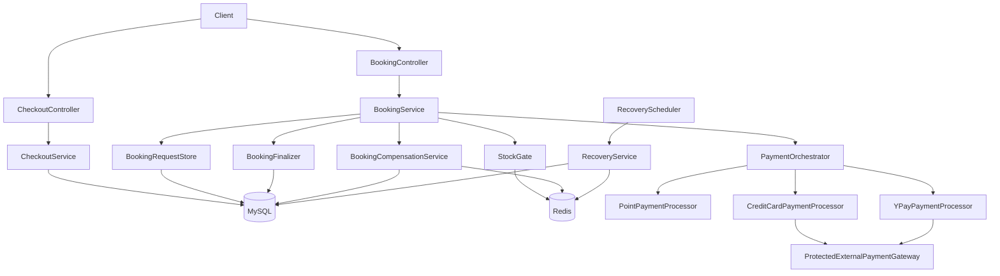
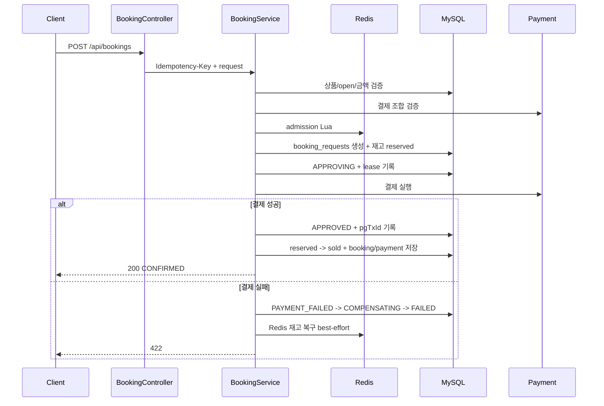
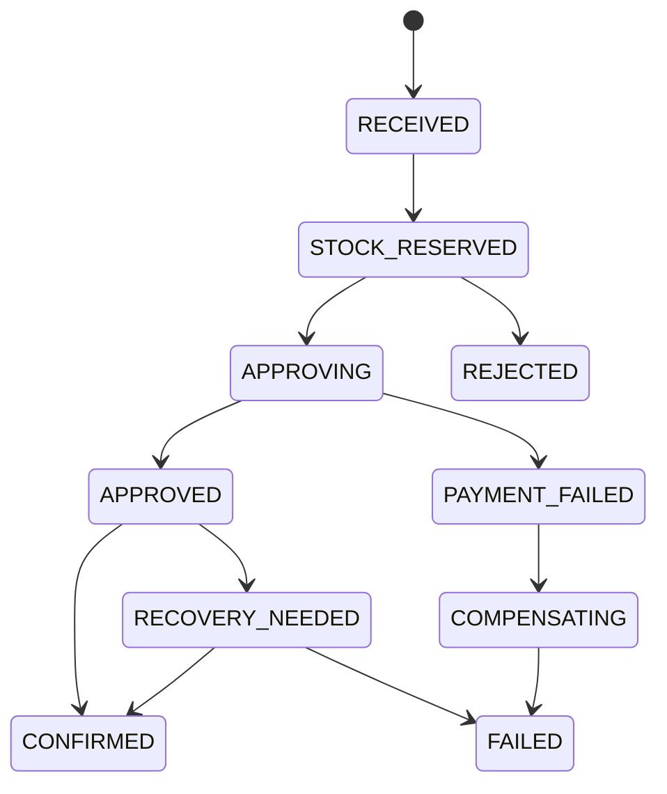

# Stay Booking

한정 수량 숙박 프로모션 예약 API입니다. 00시 오픈처럼 짧은 시간에 요청이 몰리는 상황에서 초과 판매를 막고, 멱등키로 중복 결제를 방지하며, 결제/예약 중간 실패를 복구 가능한 상태로 남기는 것을 목표로 합니다.

## 1. 목표와 설계 방향

이 시스템의 핵심은 단순 예약 CRUD가 아니라, **재고 10개에 수백~수천 개 요청이 동시에 들어와도 최종 예약은 10건을 넘지 않게 만드는 것**입니다. 동시에 사용자가 같은 결제 요청을 재전송해도 돈이 두 번 빠지지 않아야 하고, 결제 승인 직후 애플리케이션이 죽어도 예약 또는 보상 중 하나로 수렴해야 합니다.

| 목표 | 설계 방향 |
|------|-----------|
| 초과 판매 방지 | Redis admission으로 초과 요청을 먼저 거절하고, MySQL 조건부 UPDATE로 최종 방어 |
| 중복 결제 방지 | `Idempotency-Key` + `request_hash` + DB unique constraint |
| 실패 복구 | 예약 요청 상태 머신, 짧은 트랜잭션, Recovery Job |
| 결제 장애 격리 | PG 호출에 Bulkhead, TimeLimiter, CircuitBreaker 적용 |
| 검증 가능성 | MySQL 8, Redis 7 기반 통합 테스트와 로컬 부하테스트 결과 |

범위는 의도적으로 좁혔습니다. 인증/인가, 실제 PG 연동, 객실 타입별 재고, 운영자 화면은 제외하고, 동시성·멱등성·보상·복구에 집중했습니다.

## 2. 내부 아키텍처



역할은 세 층으로 나눕니다.

| 층 | 책임 |
|----|------|
| API | 요청 검증, `Idempotency-Key` 수신, 성공/실패 응답 형식 통일 |
| Application | 예약 오케스트레이션, 짧은 트랜잭션 단위 저장, 결제 조합 실행, 보상/복구 |
| Infrastructure | Redis admission, 외부 PG 시뮬레이션, PG 보호 장치, JSON 로그 |

`BookingService`는 전체 예약 흐름을 조율하지만, 메서드 전체를 하나의 DB 트랜잭션으로 묶지 않습니다. 외부 PG 호출 중 DB 커넥션을 붙잡으면 피크 상황에서 커넥션 풀이 고갈될 수 있기 때문입니다. 대신 각 단계가 필요한 상태를 먼저 DB에 남기고, 짧은 트랜잭션을 순서대로 실행합니다.

Redis와 MySQL의 책임도 분리합니다. Redis는 매진 이후의 대량 요청을 빠르게 거절하는 admission gate이고, MySQL은 실제 예약 가능 수량과 멱등성의 최종 방어선입니다. Redis 값이 틀어져도 DB의 조건부 UPDATE가 초과 판매를 막고, Redis 복구가 불명확하면 중복 `INCR`을 재시도하지 않고 DB 기준 stock sync로 수렴시킵니다.

## 3. 예약 생성 흐름



흐름을 단계로 풀면 다음과 같습니다.

| 단계 | 처리 | 실패 시 |
|------|------|---------|
| 1. 검증 | 상품 존재, 오픈 시간, 결제 조합, 서버 기준 금액 확인 | DB 상태 기록 없이 4xx |
| 2. Redis admission | `stock:{productId}`를 Lua로 원자 차감 | 매진 409, Redis 장애 503 |
| 3. DB reserve | `booking_requests` 생성, `available -> reserved` | DB 기준 매진이면 결제 전 거절 |
| 4. 결제 | 포인트 선차감 후 외부 결제 승인 | 포인트/재고 보상 후 실패 |
| 5. 확정 | `reserved -> sold`, 예약/결제 저장, `CONFIRMED` | Recovery Job이 재시도 |

예약 요청은 아래 상태 중 하나로 남습니다. 상태가 남기 때문에 장애가 난 지점을 로그와 DB 한 행으로 추적할 수 있고, Recovery Job은 종결되지 않은 상태만 다시 처리합니다.



주요 상태의 의미는 다음과 같습니다.

| 상태 | 의미 |
|------|------|
| `RECEIVED` | 요청을 접수했고 멱등성 기록을 남긴 상태 |
| `STOCK_RESERVED` | Redis admission과 DB 재고 예약까지 완료했지만 결제는 아직 시작하지 않은 상태 |
| `APPROVING` | PG 호출 직전에 lease를 남긴 상태. 오래 머물면 Recovery Job이 보상으로 수렴시킴 |
| `APPROVED` | 결제 승인은 성공했고 예약 확정 트랜잭션만 남은 상태 |
| `CONFIRMED` | 예약, 결제, 재고 확정이 모두 끝난 최종 성공 상태 |
| `PAYMENT_FAILED` | 결제 실패를 기록했고 보상 진입을 기다리는 상태 |
| `COMPENSATING` | 포인트/재고 보상을 수행 중인 상태 |
| `FAILED` / `REJECTED` | 보상 또는 거절 처리가 끝난 최종 실패 상태 |
| `RECOVERY_NEEDED` | 즉시 확정/보상이 끝나지 않아 Recovery Job이 이어받아야 하는 상태 |

## 4. 핵심 구현 전략

### 4.1 재고

| 단계 | 동작 |
|------|------|
| Redis admission | 매진 초과 요청을 DB write 전에 차단 |
| DB reserve | `available_quantity - 1`, `reserved_quantity + 1` |
| 확정 | `reserved_quantity - 1`, `sold_quantity + 1` |
| 실패 보상 | `reserved_quantity - 1`, `available_quantity + 1` |
| Redis 복구 | `INCR` best-effort 1회. 실패/불명확하면 DB 기준 동기화 대상 |

`promotion_products`는 재고를 세 칸으로 나눕니다.

| 컬럼 | 의미 |
|------|------|
| `available_quantity` | 지금 예약 가능한 수량. Redis stock sync 기준 |
| `reserved_quantity` | Redis admission은 통과했고 결제/확정 중인 수량 |
| `sold_quantity` | 최종 확정된 예약 수량 |

이 구조를 쓰면 판매가 끝난 수량뿐 아니라, 결제와 예약 확정 사이에 잠시 묶여 있는 수량까지 DB에 남길 수 있습니다. 그래서 Redis 재고가 틀어졌을 때도 "지금 새로 받을 수 있는 수량"을 기준으로 다시 맞출 수 있습니다.

### 4.2 멱등성

클라이언트는 예약 생성 요청에 `Idempotency-Key`를 반드시 보냅니다. 서버는 `user_id + idempotency_key`를 유일하게 저장하고, 같은 키로 들어온 요청의 payload hash를 비교합니다.

| 상황 | 응답 |
|------|------|
| 같은 키, 같은 payload, 처리 중 | 409 `REQUEST_IN_PROGRESS` |
| 같은 키, 같은 payload, 확정 완료 | 기존 예약 응답 재생 |
| 같은 키, 다른 payload | 409 `IDEMPOTENCY_KEY_REUSED_WITH_DIFFERENT_PAYLOAD` |

멱등성의 최종 진실은 DB unique constraint입니다. Redis admission은 중복 요청을 빠르게 막는 보조 장치로만 사용합니다.

### 4.3 결제

지원 조합은 Card, YPay, Point, Card+Point, YPay+Point입니다. Card와 YPay는 외부 결제 수단이므로 함께 사용할 수 없습니다.

| 수단 | 처리 |
|------|------|
| 신용카드 | 외부 PG 시뮬레이터 호출 |
| Y페이 | 외부 PG 시뮬레이터 호출 |
| 포인트 | `user_points` 조건부 UPDATE |
| 복합 결제 | 포인트 먼저 차감, 외부 결제 나중 승인 |

포인트를 먼저 차감하는 이유는 보상 가능성이 더 높기 때문입니다. 외부 결제 승인 후 포인트 차감이 실패하면 외부 취소가 필요하지만, 포인트 선차감 후 외부 결제가 거절되면 자사 DB에서 포인트 환불로 수렴할 수 있습니다.

PG 호출은 느려지거나 실패할 수 있으므로 보호 장치를 둡니다.

| 보호 장치 | 역할 |
|-----------|------|
| Bulkhead | 동시에 PG로 나가는 호출 수 제한 |
| TimeLimiter | 느린 PG 호출을 일정 시간 뒤 실패 처리 |
| CircuitBreaker | 반복 실패 시 일정 시간 PG 호출 차단 |

### 4.4 보상과 복구

결제와 Redis는 DB 트랜잭션처럼 함께 롤백할 수 없습니다. 그래서 실패를 없애려 하지 않고, 실패 위치를 상태로 남긴 뒤 보상 또는 재시도로 수렴시킵니다.

| 상황 | 처리 |
|------|------|
| 결제 거절 | 포인트 환불, DB 재고 release, Redis release |
| 보상 동시 진입 | `PAYMENT_FAILED -> COMPENSATING` CAS로 한 경로만 진입 |
| 포인트 환불 중복 | `point_history` unique constraint로 차단 |
| Redis release 불명확 | `stock_restore_status=NEEDS_SYNC`로 남김 |
| `STOCK_RESERVED` 만료 | 결제 전 상태이므로 재고 복구 후 `REJECTED` |
| `APPROVED` 장기 체류 | 결제 승인 식별자가 있으므로 예약 확정 재시도 |
| `COMPENSATING` 체류 | 보상 이어받기 |

## 5. API

### 5.1 Checkout

```http
GET /api/checkout?productId=1&userId=100
```

```json
{
  "productId": 1,
  "name": "제주 오션뷰 스테이",
  "price": 150000,
  "checkinDate": "2026-07-01",
  "checkoutDate": "2026-07-02",
  "open": true,
  "pointBalance": 50000
}
```

Checkout은 주문서 조회입니다. 상품 정보와 포인트 잔액을 보여주지만 재고를 차감하지 않습니다.

### 5.2 Booking

```http
POST /api/bookings
Idempotency-Key: unique-key
Content-Type: application/json

{
  "productId": 1,
  "userId": 100,
  "paymentMethods": ["CREDIT_CARD", "Y_POINT"],
  "pointAmount": 30000,
  "cardNumber": "4111-1111-1111-1234"
}
```

```json
{
  "bookingId": 1,
  "status": "CONFIRMED"
}
```

### 5.3 Internal

```http
POST /internal/products/{productId}/stock-sync
```

DB `available_quantity` 기준으로 Redis `stock:{productId}`를 덮어씁니다. Redis 보상 실패나 운영 점검 후 재고 캐시를 DB 기준으로 회복할 때 쓰는 내부 API입니다.

### 5.4 Error

```json
{
  "code": "SOLD_OUT",
  "message": "매진되었습니다.",
  "traceId": "unique-key"
}
```

주요 에러 코드는 아래와 같습니다.

| code | HTTP | 의미 |
|------|------|------|
| `INVALID_REQUEST` | 400 | 요청 형식 오류 |
| `INVALID_PAYMENT_COMBINATION` | 400 | 결제 조합 오류 |
| `PRODUCT_NOT_FOUND` | 404 | 상품 없음 |
| `PRODUCT_NOT_OPEN` | 409 | 오픈 전 |
| `SOLD_OUT` | 409 | 매진 |
| `REQUEST_IN_PROGRESS` | 409 | 같은 요청 처리 중 |
| `IDEMPOTENCY_KEY_REUSED_WITH_DIFFERENT_PAYLOAD` | 409 | 같은 키 다른 payload |
| `STOCK_GATE_UNAVAILABLE` | 503 | Redis admission 장애 |
| `PAYMENT_DECLINED` | 422 | 외부 결제 거절 |
| `INSUFFICIENT_POINT` | 422 | 포인트 부족 |

## 6. DB 스키마

스키마의 중심은 `booking_requests`입니다. 단순 요청 로그가 아니라, 멱등키, 요청 hash, 현재 처리 상태, PG 승인 식별자, 보상 여부, 복구에 필요한 시간을 함께 담습니다. 같은 멱등키 요청이 다시 들어오면 이 테이블을 기준으로 진행 중인지, 완료되었는지, 다른 payload인지 판단합니다.

- `promotion_products`: 상품 정보와 재고 수량을 함께 보관합니다. `available + reserved + sold = total` 관계를 유지합니다.
- `user_points`: 사용자 포인트 잔액입니다. 포인트 결제는 이 테이블의 조건부 UPDATE로 차감합니다.
- `bookings`: 최종 확정된 예약입니다. 하나의 `booking_request`는 최대 하나의 예약으로만 확정됩니다.
- `payments`: 확정된 결제 기록입니다. 같은 PG transaction id가 중복 저장되지 않게 막습니다.
- `point_history`: 포인트 차감/환불 이력입니다. 같은 예약 요청에 같은 종류의 포인트 이력이 중복 저장되지 않게 막아 보상 재시도를 멱등하게 만듭니다.

## 7. 실행 방법

필요한 런타임은 Java 17, Docker, Docker Compose입니다. MySQL 8과 Redis 7은 `docker-compose.yml`로 실행합니다.

```bash
docker compose up -d
./gradlew bootRun --args='--spring.profiles.active=local'
```

테스트:

```bash
./gradlew test --rerun-tasks
```

부하테스트:

```bash
k6 run -e BASE_URL=http://localhost:8080 -e PRODUCT_ID=1 load-test/booking.js
```

k6 설치가 필요합니다.

## 8. 검증 결과

현재 통합 테스트 결과:

| tests | failures | errors |
|------:|---------:|-------:|
| 43 | 0 | 0 |

주요 검증:

| 시나리오 | 검증 |
|----------|------|
| 재고 10, 동시 예약 1000 | 확정 10, oversell 0 |
| 같은 멱등키 재요청 | 기존 예약 응답 재생 |
| 같은 키 다른 payload | 409 |
| Redis 장애 | 503 Fail-Closed |
| PG 반복 실패 | CircuitBreaker open |
| 카드 거절 + 포인트 | 포인트/재고 보상 후 `FAILED` |
| `APPROVED` stuck | 확정 재시도 |
| 보상 동시 진입 | Redis 재고 1회 복구 |
| Redis drift | DB reserve 단계에서 결제 전 거절 |
| internal stock sync | DB 기준 Redis 덮어쓰기 |

로컬 부하테스트 요약:

| 시나리오 | 요청/동시성 | 결과 |
|----------|-------------|------|
| baseline | 1000 / 100 | 200=10, 409=990, sold=10, oversell=0 |
| PG decline | 100 / 20 | 422=100, 재고 원복, 예약/결제 0 |
| PG timeout/circuit | 50 / 20 | 422=50, TimeLimiter/CircuitBreaker 경로, 재고 원복 |

로컬 단일 인스턴스 부하테스트 결과:

| 항목 | 값 |
|------|----|
| 요청/동시성 | 1000 / 100 |
| 처리량 | 286.45 req/s |
| 응답 분포 | 200 = 10, 409 = 990 |
| latency | p95 = 1021 ms, p99 = 1124 ms |
| DB/Redis 최종 상태 | sold = 10, reserved = 0, Redis stock = 0 |

이 결과는 운영 처리량 보장값이 아닙니다. 이 프로젝트에서는 보호 장치가 실제로 동작하는지, 재고보다 많은 예약이 확정되지 않는지, 실패 상태가 복구 가능한 형태로 남는지를 확인하는 근거로 사용합니다.

## 9. 한계와 추후 개선

- 실제 PG inquiry 계약은 범위에서 제외했습니다. 그래서 `pgTxId`가 저장된 `APPROVED` 상태는 확정 재시도하고, 승인 식별자가 없는 `APPROVING` 만료는 보상/실패로 수렴합니다.
- internal API에는 운영 환경에서 인증/인가가 필요합니다.
- `NEEDS_SYNC` 상태는 운영 알람이나 admin 화면으로 노출할 수 있습니다.
- 현재 부하 결과는 로컬 단일 인스턴스 기준입니다. 운영 처리량 보장값으로 사용하지 않고 병목과 보호장치 동작 근거로만 해석합니다.
- 설계 전제는 앱 서버 2대 이상입니다. `maximum-pool-size=20`은 인스턴스당 값이므로 서버 2대에서는 최대 40개 DB 커넥션을 고려해야 합니다.
- Recovery 중복 실행은 CAS/unique로 최종 효과를 막지만, 운영 비용 최적화에는 leader election이나 distributed lock을 추가할 수 있습니다.
