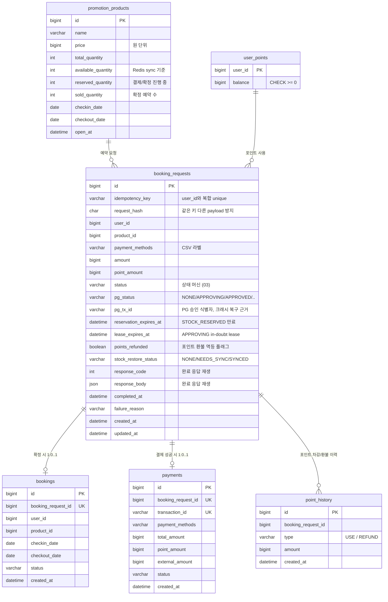

# 11. 스키마 설계

> 상태: **확정**

## 설계 원칙

이 프로젝트의 핵심은 스키마 진화 관리가 아니라 **재고 정합성, 멱등성, 결제 보상**이다.
따라서 상품과 재고는 하나의 `promotion_products` 테이블에 둔다.
대신 재고 수량은 `available/reserved/sold`로 나누어 Redis 선점 후 진행 중인 수량까지 DB에 표현한다.

```text
available_quantity + reserved_quantity + sold_quantity = total_quantity
```

이 구조는 별도 재고 테이블 없이 단순하게 유지하면서도, Redis 재동기화 시 `available_quantity`만 보면 되게 만든다.

## ERD



## 물리 FK

현재 구현에서는 FK를 필수로 두지 않는다.

본 제출물에서는 동시성 실험의 단순성과 테스트 격리를 위해 물리 FK는 생략한다.
대신 애플리케이션 계층 검증, NOT NULL, UNIQUE, CHECK, 통합 테스트로 핵심 불변식을 검증한다.
운영 환경에서는 FK 또는 주기적 무결성 검증 쿼리를 추가하는 것이 적절하다.

## 핵심 제약 조건과 그 이유

| 제약 | 막는 사고 |
|------|----------|
| `booking_requests (user_id, idempotency_key)` UNIQUE | 사용자별 중복 결제의 최후 방어선. DB UNIQUE는 만료 없음 |
| `booking_requests.request_hash` | 같은 멱등키로 다른 payload를 보내는 요청 거절 |
| `bookings.booking_request_id` UNIQUE | 복구 재시도가 예약을 중복 생성 |
| `payments.booking_request_id` UNIQUE | 한 요청에 결제 기록 2건 |
| `payments.transaction_id` UNIQUE | 같은 승인 건의 중복 기록 |
| `point_history (booking_request_id, type)` UNIQUE | 보상 재실행 시 포인트 이중 환불 |
| `promotion_products` CHECK `available + reserved + sold = total` | 재고 수량 불변식 |
| `user_points` CHECK `balance >= 0` | 음수 포인트 |
| 조건부 UPDATE `WHERE available_quantity > 0` | 중복 예약/oversell |

## 보상 상태 컬럼

Redis 재고 복구는 중복 INCR이 가장 위험하다. 따라서 boolean 하나로 "복구 완료"를 표시하지 않고
`stock_restore_status`로 상태를 남긴다.

| 값 | 의미 |
|----|------|
| `NONE` | 재고 보상 대상이 아니거나 아직 처리 전 |
| `SYNCED` | Redis INCR 성공 또는 이후 stock sync 완료 |
| `NEEDS_SYNC` | Redis INCR 실패/불명확. 중복 INCR 금지, DB 기준 stock sync 필요 |

`NEEDS_SYNC`는 일시적 under-sell을 허용하는 선택이다.
초과판매 위험이 있는 중복 INCR보다 덜 팔림을 선택하고, 최종 Redis 값은 DB 기준 sync로 회복한다.

## 응답 재생 컬럼

완료된 멱등키는 같은 응답을 재생해야 한다.
성공 응답은 `bookings`/`payments`에서 재구성할 수 있지만, 실패 응답까지 안정적으로 재생하기 위해
`response_code`, `response_body`, `completed_at`을 둔다.

## 스키마 관리

현재 구현은 `schema.sql`을 사용한다.

- 초기 구현 1회 제출물에서는 Flyway 같은 versioned migration이 핵심 역량을 더 드러내지 못한다.
- DDL을 파일로 명시하고 `ddl-auto=none`으로 두면 "코드 수정 없이 실행 가능한 소스" 요건을 만족한다.
- 운영 환경이라면 Flyway를 도입해 변경 이력을 관리하는 것이 적절하지만, 현재는 운영 확장안으로만 남긴다.

## DDL (`schema.sql`)

```sql
CREATE TABLE IF NOT EXISTS promotion_products (
    id             BIGINT AUTO_INCREMENT PRIMARY KEY,
    name           VARCHAR(100) NOT NULL,
    price          BIGINT       NOT NULL,
    total_quantity INT          NOT NULL,
    available_quantity INT      NOT NULL,
    reserved_quantity  INT      NOT NULL DEFAULT 0,
    sold_quantity  INT          NOT NULL DEFAULT 0,
    checkin_date   DATE         NOT NULL,
    checkout_date  DATE         NOT NULL,
    open_at        DATETIME(6)  NOT NULL,
    CONSTRAINT chk_stock_non_negative CHECK (
        available_quantity >= 0 AND reserved_quantity >= 0 AND sold_quantity >= 0
    ),
    CONSTRAINT chk_stock_total CHECK (
        available_quantity + reserved_quantity + sold_quantity = total_quantity
    )
);

CREATE TABLE IF NOT EXISTS user_points (
    user_id BIGINT PRIMARY KEY,
    balance BIGINT NOT NULL,
    CONSTRAINT chk_balance_non_negative CHECK (balance >= 0)
);

CREATE TABLE IF NOT EXISTS booking_requests (
    id                   BIGINT AUTO_INCREMENT PRIMARY KEY,
    idempotency_key      VARCHAR(64) NOT NULL,
    request_hash         CHAR(64)    NOT NULL,
    user_id              BIGINT      NOT NULL,
    product_id           BIGINT      NOT NULL,
    payment_methods      VARCHAR(40) NOT NULL,
    amount               BIGINT      NOT NULL,
    point_amount         BIGINT      NOT NULL DEFAULT 0,
    status               VARCHAR(20) NOT NULL,
    pg_status            VARCHAR(20) NOT NULL DEFAULT 'NONE',
    pg_tx_id             VARCHAR(64),
    reservation_expires_at DATETIME(6),
    lease_expires_at     DATETIME(6),
    points_refunded      BOOLEAN     NOT NULL DEFAULT FALSE,
    stock_restore_status VARCHAR(20) NOT NULL DEFAULT 'NONE',
    failure_reason       VARCHAR(200),
    response_code        INT,
    response_body        JSON,
    completed_at         DATETIME(6),
    created_at           DATETIME(6) NOT NULL,
    updated_at           DATETIME(6) NOT NULL,
    CONSTRAINT uk_booking_requests_user_idempotency UNIQUE (user_id, idempotency_key),
    INDEX idx_booking_requests_status_updated (status, updated_at),
    INDEX idx_booking_requests_status_reservation (status, reservation_expires_at),
    INDEX idx_booking_requests_status_lease (status, lease_expires_at),
    INDEX idx_booking_requests_stock_restore (stock_restore_status)
);

CREATE TABLE IF NOT EXISTS bookings (
    id                 BIGINT AUTO_INCREMENT PRIMARY KEY,
    booking_request_id BIGINT      NOT NULL,
    user_id            BIGINT      NOT NULL,
    product_id         BIGINT      NOT NULL,
    checkin_date       DATE        NOT NULL,
    checkout_date      DATE        NOT NULL,
    status             VARCHAR(20) NOT NULL,
    created_at         DATETIME(6) NOT NULL,
    CONSTRAINT uk_bookings_booking_request UNIQUE (booking_request_id)
);

CREATE TABLE IF NOT EXISTS payments (
    id                 BIGINT AUTO_INCREMENT PRIMARY KEY,
    booking_request_id BIGINT      NOT NULL,
    transaction_id     VARCHAR(64) NOT NULL,
    payment_methods    VARCHAR(40) NOT NULL,
    total_amount       BIGINT      NOT NULL,
    point_amount       BIGINT      NOT NULL,
    external_amount    BIGINT      NOT NULL,
    status             VARCHAR(20) NOT NULL,
    created_at         DATETIME(6) NOT NULL,
    CONSTRAINT uk_payments_booking_request UNIQUE (booking_request_id),
    CONSTRAINT uk_payments_transaction UNIQUE (transaction_id)
);

CREATE TABLE IF NOT EXISTS point_history (
    id                 BIGINT AUTO_INCREMENT PRIMARY KEY,
    booking_request_id BIGINT      NOT NULL,
    type               VARCHAR(10) NOT NULL,
    amount             BIGINT      NOT NULL,
    created_at         DATETIME(6) NOT NULL,
    CONSTRAINT uk_point_history_order_type UNIQUE (booking_request_id, type)
);
```

## Redis 키 설계

| 키 | 타입 | TTL | 용도 |
|----|------|-----|------|
| `stock:{productId}` | string(int) | 없음 | 재고 선점 카운터. DB `available_quantity`에서 파생, sync로 재계산 |
| `idem:{idempotencyKey}` | string | 24h | 멱등성 가속 캐시. DB UNIQUE가 영구 보증, TTL은 성능용 |
| `admission:{userId}:{idempotencyKey}` | string | 짧은 TTL | Redis admission 중복 DECR 방지 |

---

## 확정 사항 요약

- [x] **단순 스키마**: `promotion_products` 하나에 상품/재고를 둔다. 핵심 설명을 우선한다.
- [x] **재고 수량 분리**: available/reserved/sold로 진행 중 선점 수량을 DB에 표현한다.
- [x] **조건부 UPDATE**: `WHERE available_quantity > 0` reserve가 oversell 최후 방어선.
- [x] **schema.sql 사용**: Flyway는 운영 확장안으로만 문서화한다.
- [x] **request_hash**: 같은 idempotency key로 다른 payload를 보내면 거절한다.
- [x] **보상 상태 컬럼**: `stock_restore_status=NONE/NEEDS_SYNC/SYNCED`.
- [x] **상태 추적 컬럼**: `pg_status`, `pg_tx_id`, `lease_expires_at`.
